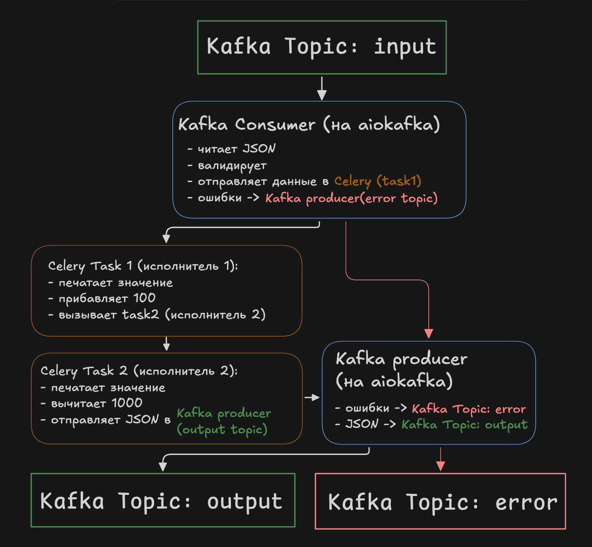

# Architecture

## 📌 Components

### 1. Kafka Consumer (Python + aiokafka)

- Reads messages from Kafka `input`
- Validates JSON and presence of numeric field `value`
- Errors - passed to Kafka `error`
- Valid data - passed to `task_1`
- Offset is committed manually

### 2. Celery Worker (Python + Redis)

#### `task_1`:
- Gets a number, prints it
- Generates an exception with a 30% probability
- On success: adds 100 and passes `task_2`.

#### `task_2`:
- Gets a number, prints
- Generates an exception with a 30% probability
- On success: subtracts 1000 and sends the result to Kafka `output` format:
```json
{ "result": <number> }
```

Both tasks use `autoretry_for`, `retry_backoff`, `max_retries=3`.

## 🔁 Data flow


