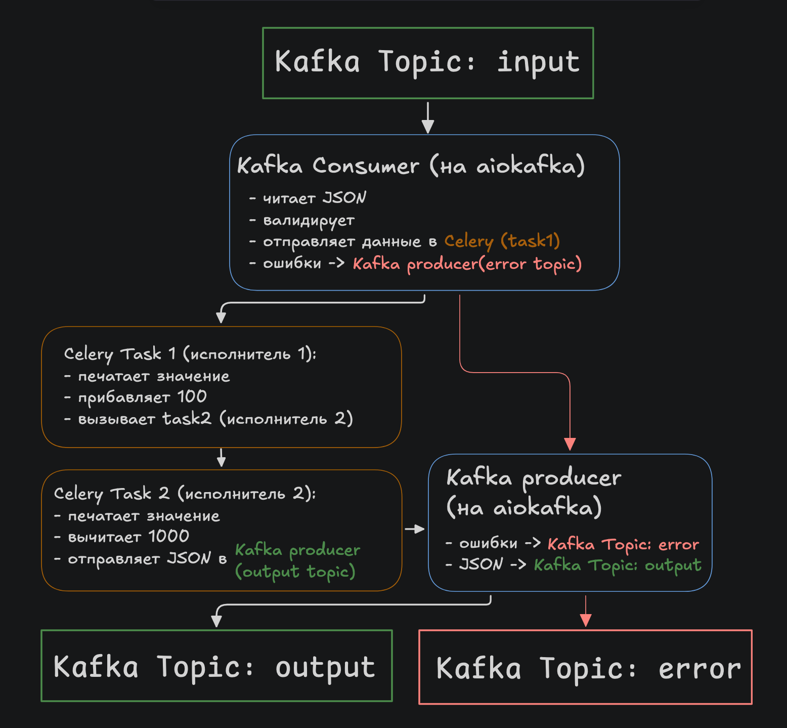

# Architecture

## Components

### 1. Kafka Consumer (Python + aiokafka)

- Reads messages from Kafka `input` topic
- Validates JSON and presence of numeric field `value`
- Invalid messages are forwarded to Kafka `error` topic
- Valid data is enqueued to Celery `task_1`
- Offset is committed manually after each message is enqueued

### 2. Celery Worker (Python + Redis)

#### `task_1`:
- Receives a number, logs it
- Adds 100 and enqueues `task_2`

#### `task_2`:
- Receives a number, logs it
- Subtracts 1000 and enqueues `send_kafka_task`

#### `send_kafka_task`:
- Publishes the final result to Kafka `output` topic:
```json
{ "result": <number> }
```

All tasks use `autoretry_for=(TransientProcessingError,)`, `retry_backoff=True`, `max_retries` from settings (default 3).

## Data flow



## Delivery Guarantees

The service uses **at-most-once** delivery semantics.

**How it works:** the consumer commits the Kafka offset immediately after `handle_message()` enqueues a Celery task, not after the worker finishes executing it.

**What this means in practice:**

1. Consumer reads a message from Kafka
2. `handle_message()` validates and calls `task_1.delay()` (enqueues to Redis)
3. Consumer commits the offset
4. The Celery worker picks up and processes the task asynchronously

If the worker crashes between steps 3 and 4, the message will not be redelivered because the offset has already been committed. The message is effectively lost.

**Why this trade-off was made:**
- Simpler architecture — no need for distributed transaction coordination
- Lower latency — the consumer doesn't block waiting for task completion
- Acceptable for non-critical data pipelines where occasional message loss is tolerable

**Celery-level retries** cover transient failures *within* task execution (e.g. temporary Kafka unavailability when publishing results). Only `TransientProcessingError` triggers a retry, with exponential backoff.

**Upgrade path for stronger guarantees:**
- At-least-once: commit the offset only after the task acknowledges completion (`task_acks_late=True`), and make consumers idempotent to handle duplicate deliveries
- Exactly-once: use Kafka transactions or switch to a stream processing framework (Kafka Streams, Faust)

## Security

This is a **development-only** setup. No authentication or encryption is configured between services.

**Current state:**
- Kafka: plaintext listener, no SASL/SSL (`ALLOW_PLAINTEXT_LISTENER=yes`)
- Redis: no password by default (configurable via `REDIS_PASSWORD` env var)
- Zookeeper: anonymous login enabled (`ALLOW_ANONYMOUS_LOGIN=yes`)
- All inter-service traffic is unencrypted

**For production deployment, the following would be required:**
- Kafka: SASL/SCRAM or mTLS authentication, TLS-encrypted listeners
- Redis: password authentication (`requirepass`) + TLS connections
- Secrets management: use a vault (HashiCorp Vault, AWS Secrets Manager) instead of plain `.env` files
- Network isolation: place services in a private network, restrict exposed ports
- Zookeeper removal: migrate to KRaft mode (planned in Phase 7) to eliminate one attack surface
