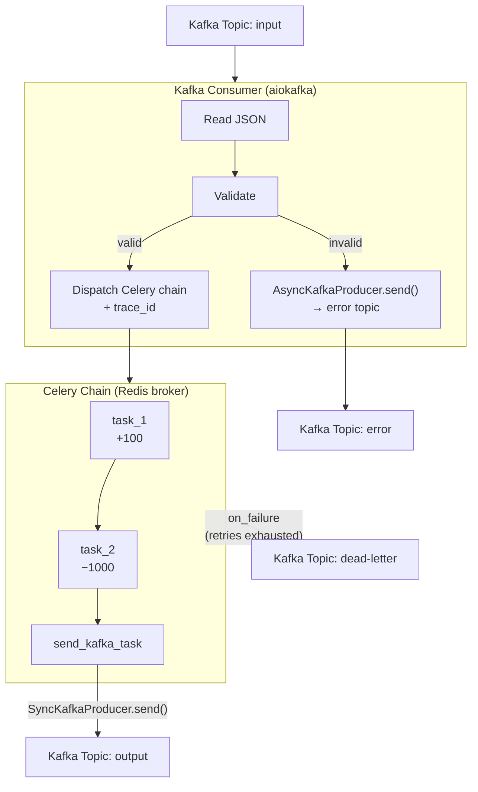

# Architecture

## Components

### 1. Kafka Consumer (Python + aiokafka)

- Reads messages from Kafka `input` topic
- Validates JSON and presence of numeric field `value`
- Accepts optional demo-only field `fail` with values `task_1`, `task_2`, or `send_kafka_task`
- Generates a `trace_id` (UUID) per message for end-to-end correlation
- Invalid messages are forwarded to Kafka `error` topic via async producer
- Valid data is dispatched as a Celery chain: `task_1 | task_2 | send_kafka_task`
- Offset is committed manually after each message is enqueued
- Heartbeat loop touches `/tmp/consumer-alive` every 20s for Docker healthcheck

### 2. Celery Worker (Python + Redis)

Tasks are linked via a Celery `chain()` — each task returns a value that becomes the input of the next.

#### `task_1`:
- Receives a number, adds 100, returns the result

#### `task_2`:
- Receives the result from `task_1`, subtracts 1000, returns the result

#### `send_kafka_task`:
- Publishes the final result to Kafka `output` topic via synchronous producer (kafka-python):
```json
{ "result": <number>, "trace_id": "<uuid>" }
```

All tasks use `autoretry_for=(TransientProcessingError,)`, `retry_backoff=True`, `max_retries` from settings (default 3).

For demonstration, a valid input message can intentionally fail a task:

```json
{ "value": 10, "fail": "task_2" }
```

The matching task raises `TransientProcessingError`, Celery retries it, and the
base task sends a failure record to the DLQ after retries are exhausted.

### 3. Dead Letter Queue

When a task exhausts all retries, the `DLQTask` base class sends the failure details to the `dead-letter` Kafka topic:
- Task name, ID, original arguments
- Exception message and traceback
- `trace_id` for correlation

### 4. Producers

| Producer | Library | Used by | Lifecycle |
|---|---|---|---|
| `AsyncKafkaProducer` | aiokafka | Consumer (error messages) | Created in `consume()`, passed to `handle_message()` |
| `SyncKafkaProducer` | kafka-python | Celery tasks (output, DLQ) | Module-level instance, lazy-initialized on first `send()` |

No global mutable state — producers are class instances with explicit lifecycle management.

## Data flow

High-level pipeline:

```text
                        +----------------+
                        | Kafka: input   |
                        +-------+--------+
                                |
                                v
                        +-------+--------+
                        | Consumer       |
                        | validate JSON  |
                        +---+--------+---+
                            |        |
                 valid JSON |        | invalid JSON / bad fail flag
                            |        v
                            |   +----+---------+
                            |   | Kafka: error |
                            |   +--------------+
                            v
                 +----------+-----------+
                 | Celery chain         |
                 | task_1 -> task_2 ->  |
                 | send_kafka_task      |
                 +-----+----------+-----+
                       |          |
                 success          | retries exhausted
                       v          v
              +--------+---+  +---+--------------+
              | Kafka:    |  | Kafka: dead-letter |
              | output    |  +--------------------+
              +-----------+
```

Success path:

```text
{"value": 10}
  -> consumer creates trace_id
  -> task_1: 10 + 100 = 110
  -> task_2: 110 - 1000 = -890
  -> send_kafka_task publishes {"result": -890, "trace_id": "..."}
```

Invalid-message path:

```text
{"foo": "bar"} or not-json
  -> consumer validation fails
  -> AsyncKafkaProducer publishes {"error": <raw message>, "trace_id": "..."}
```

Retry and DLQ path:

```text
{"value": 10, "fail": "task_2"}
  -> task_1 succeeds
  -> task_2 raises TransientProcessingError
  -> Celery retries with backoff
  -> DLQTask.on_failure publishes task details to Kafka: dead-letter
```

Trace propagation:

```text
consumer generates trace_id
  -> task_1(trace_id=...)
  -> task_2(trace_id=...)
  -> send_kafka_task(trace_id=...)
  -> output/error/dead-letter payload
  -> JSON logs in consumer and worker
```


```mermaid
flowchart TD
    INPUT["Kafka Topic: input"] --> CONSUMER

    subgraph CONSUMER["Kafka Consumer (aiokafka)"]
        direction TB
        C1[Read JSON] --> C2[Validate]
        C2 -->|valid| C3["Dispatch Celery chain\n+ trace_id"]
        C2 -->|invalid| C4["AsyncKafkaProducer.send()\n→ error topic"]
    end

    C3 --> CHAIN

    subgraph CHAIN["Celery Chain (Redis broker)"]
        direction TB
        T1["task_1\n+100"] --> T2["task_2\n−1000"] --> T3["send_kafka_task"]
    end

    T3 -->|"SyncKafkaProducer.send()"| OUTPUT["Kafka Topic: output"]
    C4 --> ERROR["Kafka Topic: error"]

    CHAIN -.->|"on_failure\n(retries exhausted)"| DLQ["Kafka Topic: dead-letter"]
```

## Delivery Guarantees

The service uses **at-most-once** delivery semantics.

**How it works:** the consumer commits the Kafka offset immediately after `handle_message()` dispatches a Celery chain, not after the worker finishes executing it.

**What this means in practice:**

1. Consumer reads a message from Kafka
2. `handle_message()` validates and calls `chain(...).apply_async()` (enqueues to Redis)
3. Consumer commits the offset
4. The Celery worker picks up and processes the chain asynchronously

If the worker crashes between steps 3 and 4, the message will not be redelivered because the offset has already been committed. The message is effectively lost.

**Why this trade-off was made:**
- Simpler architecture — no need for distributed transaction coordination
- Lower latency — the consumer doesn't block waiting for task completion
- Acceptable for non-critical data pipelines where occasional message loss is tolerable

**Celery-level retries** cover transient failures *within* task execution (e.g. temporary Kafka unavailability when publishing results). Only `TransientProcessingError` triggers a retry, with exponential backoff. When retries are exhausted, the `DLQTask` base class sends failure details to the Dead Letter Queue.

**Upgrade path for stronger guarantees:**
- At-least-once: commit the offset only after the task acknowledges completion (`task_acks_late=True`), and make consumers idempotent to handle duplicate deliveries
- Exactly-once: use Kafka transactions or switch to a stream processing framework (Kafka Streams, Faust)

## Logging

All components use structured JSON logging via `python-json-logger`.

Each application log line includes: `timestamp`, `level`, `logger`, `message`.
A `trace_id` (UUID) is generated per incoming message and propagated through:
- Consumer → Celery chain arguments (`trace_id` kwarg) → `send_kafka_task` output
- Consumer and worker JSON logs
- Error and DLQ Kafka payloads

This allows tracing a single message across all log entries with:
```bash
make logs-trace TRACE_ID=<trace_id>
```

## Security

This is a **development-only** setup. No authentication or encryption is configured between services.

**Current state:**
- Kafka: plaintext listener, no SASL/SSL
- Redis: no password by default (configurable via `REDIS_PASSWORD` env var)
- All inter-service traffic is unencrypted

**For production deployment, the following would be required:**
- Kafka: SASL/SCRAM or mTLS authentication, TLS-encrypted listeners
- Redis: password authentication (`requirepass`) + TLS connections
- Secrets management: use a vault (HashiCorp Vault, AWS Secrets Manager) instead of plain `.env` files
- Network isolation: place services in a private network, restrict exposed ports
